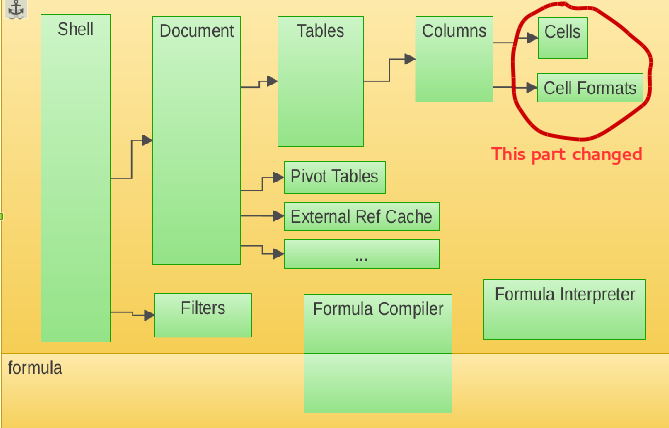
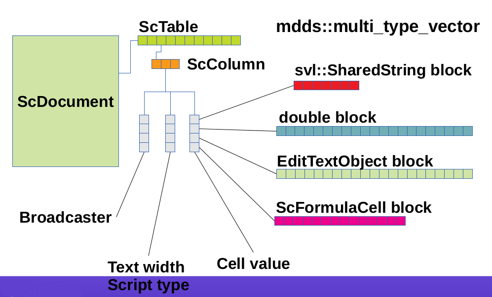

#Understanding Calc code structure#

I examined the code organization after downloading the libreoffice code by
`$ git clone git://anongit.freedesktop.org/libreoffice/core libreoffice `
The calc code is found within the directory sc/ in the source root dir. Following are the subdirs in sc/
* inc/ : there are various headers specific to the various modules within sc.
* qa/ : contains code specific to tests like unit test, performance test etc.
* sdi/ : contains files with the extension .sdi : Such files are special kind of source files that are compiled and converted to   header files.
* uiconfig/ : contains configuration files corresponding to the user interface like the toolbar, statusbar, menubar.
* source/ contains the main code. In order to find something specific try
[http://opengrok.libreoffice.org/](http://opengrok.libreoffice.org/) This is really great.

In order to understand the basic code structure I first searched for documentation and found some of them helpful.
The following diagram was obtained from [here](http://kohei.us/files/slides_libocon_2011.pdf)

Data is organized as sheets, which contain columns, and each column contains cells of rows. The hierarchy is ScDocument->ScTable->ScColumn->ScBaseCell, ScValueCell, ScStringCell, ScFormulaCell etc.

**But** the above mentioned organization was changed, and this change has been explained in Life after Calc Core change by Kohei Yoshida, 2014. According to the new model, ScColumn has three sub components: Broadcaster, Text Width Script Type and Cell value.
A Cell value can be a string block, formula block, double block, text object block.
The new model is shown below.

In [http://opengrok.libreoffice.org/xref/core/sc/inc/column.hxx#130]([http://opengrok.libreoffice.org/xref/core/sc/inc/column.hxx#130) you can see that `maBroadcasters` have been declared as the type `BroadcasterStoreType`.

BroadcasterStoreType has been declared as:

`typedef mdds::multi_type_vector<BCBlkFunc> BroadcasterStoreType;`

where BCBlkFunc has been declared as:

`typedef mdds::mtv::custom_block_func1<sc::broadcaster_block> BCBlkFunc;`

MDDS (multi dimensional data structure) provides the data structures used by calc.The latest mdds source code can be downloaded from [here](https://code.google.com/p/multidimalgorithm/wiki/Downloads)
