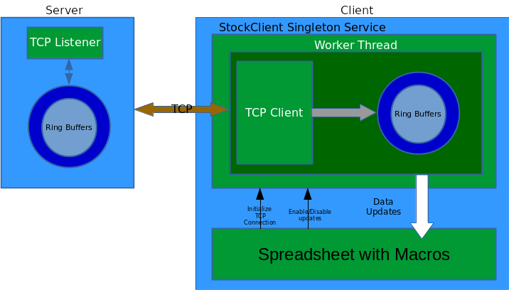

# Libreoffice extension development with C++ - Part 10 - Creating a real-time stock market data client extension.

### Audience selection

1. Audience type **[AUD-C](README.md)** can jump directly to **[Test the prebuilt extension](#prebuilt)**
2. Audience type **[AUD-B](README.md)** can jump directly to **[Download, build and test the extension](#buildsec)**

___

In this part we build an applicable extension using the techniques we learnt from previous parts. We build a stock market data client that maintains a TCP connections to a server(that we write). The client requests data updates for a particular ticker from a *particular timestamp* onwards via a JSON message. The server replies with another JSON message containing simulated data for the ticker from the requested timestamp till now. The extension(client) will now parse this JSON message and puts the data in its own buffer and updates a spreadsheet with the data. The client maintains this TCP connection to poll the server periodically.

We first discuss the high level design before going into details. Following is a sample JSON request message made by the client.
```json
{
        "Ticker"  :  "AAPL",
        "From"    :  1257894000
}
```
where the `From`'s value is the timestamp from which we want the stock data, expressed as the number of seconds elapsed since January 1, 1970 UTC. The server reponse will look like :
```json
{
        "Tstamp"  : [ 1257894001, 1257894002, 1257894003 ],
        "Price"   : [ 100.23, 100.52, 100.12 ],
        "Volume"  : [ 2340023, 2343042, 2347891 ]
}
```
Note that there are three arrays in the response json. All arrays will have the same length, here there are three data points. `Tstamp` array specifies the timestamps of each data point. `Price` array gives the price at each point in time and `Volume` gives the instantaneous volumes.

Next we describe the server-client system with a block diagram showing its components.



The extension is made of a singleton component that implements the class `StockClient` which supports the interface `XStockClient`. The definition of `XStockClient` is as follows :
```
// SimpleStockClient.idl
#ifndef __inco_niocs_test_stockclient_idl__
#define __inco_niocs_test_stockclient_idl__

#include <com/sun/star/lang/IllegalArgumentException.idl>
#include <com/sun/star/sheet/XSpreadsheet.idl>

module inco { module niocs { module test {

    interface XStockClient
    {
        void setEnableUpdates( [in] boolean bSet );
        void setSheet( [in] ::com::sun::star::sheet::XSpreadsheet rxSheet );
    };

    singleton theStockClient : XStockClient;
    service StockClient : XStockClient;
	
}; }; };

#endif

```

`setEnableUpdates()` takes a boolean flag to enable/disable updates of data from the server. `setSheet()` methods lets the user of the extension (possibly a macro as in this case) supply the sheet where the updates of data are to be written. On construction of the singleton, it spawns a worker thread (built on top of LO api's `salhelper::Thread`) that does all the work of connecting to the server and polling the server for data updates. The worker thread has a TCP client object using LO's api class `osl::ConnectorSocket`, which makes a long running connection to the address `localhost:1239` where the server is supposed to be listening. The data received during each poll is pushed into ring buffers implemented inside the class `StockRingBuffer` which consists of arrays for holding the `Tstamp`, `Price` and `Volume` components of the streamed data. The arrays have a fixed length and keeps overwriting over the oldest entries when run out of space. So it keeps track of the latest N entries of prices, timestamps and volume timeseries it receives from the server. After receiving each data update, the extension updates the sheet it has been provided by the macro to write out the latest N entries of the timeseries it has been recording. The value of N is fixed at 100. For parsing JSON message we use [rapidjson](https://www.gitbook.com/book/miloyip/rapidjson/details) C++ header only library. The files involved in the implementation of the extension are `stockclient.hxx` and `stockclient.cxx`. The server is implemented in golang in `stockserver.go`

##<a name="buildsec"></a>Download, build and test the extension

The server is written in golang, so you would need a standard golang compiler to build the server from source code. See [Install Golang](https://golang.org/doc/install).
If you do not want to build the server from source, we have provided a binary version of the same called `stockserver`.

The whole project can be downloaded, built and installed by doing :

```
$ sudo dnf install rapidjson-devel
$ git clone https://github.com/niocs/StockStreamer.git
$ cd StockStreamer
$ make
$ $LOROOT/instdir/program/unopkg add /home/$username/libreoffice5.3_sdk/LINUXexample.out/bin/SimpleStockClient.oxt
$ go build stockserver.go
```

To remove the extension, do :
```
$ $LOROOT/instdir/program/unopkg remove SimpleStockClient.oxt
```
Now we need to allow macros in Calc if you have not already. Open Calc and go to Tools > Options > Security > Click "Macro Security" > Select the radio button "Medium - Confirmation required before executing macros from untrusted source". Restart Calc. This is a one time process. To test the extension, open the file `StockClient.ods`, and it may prompt for enabling Macros, and you should enable macros. Now run the server in a separate terminal as :
```
$ cd StockStreamer
$ ./stockserver
```
Go back to the opened file in LO, and you should see three buttons on Sheet1 : `Init`, `Enable Updates`, `Disable Updates`. Click on **Init** button first, before clicking on anything else (otherwise the behaviour will be undefined). Then click on **Enable Updates**, wait for few minutes, and you should see the cell ranges A8-A107, B8-B107 and C8-C107 fill up and get updated every couple of seconds. You should also see the charts for Prices and Volume gets updated as time goes on. Clicking on **Disable Updates** will stop the updates but the client will still stay connected to the server. Clicking on **Enable Updates** will start the updates again and so on.

## <a name="prebuilt"></a>Test the prebuilt extension

Download the extension as :
```
$ git clone https://github.com/niocs/StockStreamer.git
$ cd StockStreamer
```

In `StockStreamer` directory you will see a file called `SimpleStockClient.oxt`. This is the prebuilt extension. Install this extension using

```
$ unopkg add /path/to/SimpleStockClient.oxt
```

To remove this extension do :

```
$ unopkg remove SimpleStockClient.oxt
```

Now we need to allow macros in Calc if you have not already. Open Calc and go to Tools > Options > Security > Click "Macro Security" > Select the radio button "Medium - Confirmation required before executing macros from untrusted source". Restart Calc. This is a one time process. To test the extension, open the file `StockClient.ods`, and it may prompt for enabling Macros, and you should enable macros. Now run the server in a separate terminal as :

```
$ ./stockserver
```

Go back to the opened file in LO, and you should see three buttons on Sheet1 : `Init`, `Enable Updates`, `Disable Updates`. Click on **Init** button first, before clicking on anything else (otherwise the behaviour will be undefined). Then click on **Enable Updates**, wait for few minutes, and you should see the cell ranges A8-A107, B8-B107 and C8-C107 fill up and get updated every couple of seconds. You should also see the charts for Prices and Volume gets updated as time goes on. Clicking on **Disable Updates** will stop the updates but the client will still stay connected to the server. Clicking on **Enable Updates** will start the updates again and so on.
