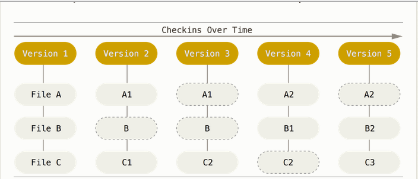
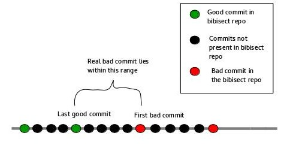

# Bibisect

This blog post is about the concept of 'bibisect'. The word bibisect is short for binary bisect.
Before going into bibisect let's review the features of **Git**.

* Git thinks of the data as a stream of snapshots: At the time of every commit, Git creates a snapshot of the file(s), which basically contains information about 'how the file looks like now'. References to these snapshots are stored. 
* For efficiency of storage, Git first checks whether the file(s) has infact changed. If there is no change then the file is not stored again, rather a link to the identical previously stored file is stored.
The following image was obtained from (http://git-scm.com/book/en/v2/Getting-Started-Git-Basics)

In the figure shown above, dashed ovals indicate links to identical previously stored files. Let us take the example of File C. The file C underwent some change, so a second version of the file is stored. The second version offile C is named C1. C1 also underwent some change, therefore a third version of the file, called C2 is stored. C2 does not change, so during the next commit a link to the previously stored version of C2 is stored. During the next commit it was found that C2 had changed, so a new version (C3) is stored.

* Local files alone are used for most Git operations. So you can see the project history almost instantaneously.
* Git preserves the integrity of data using the checksum mechanism SHA-1 hash. A SHA-1 hash is a 40 character string of hexadecimal characters.

`Eg: c7e907f58f8d0791ee304b42de769f43102522e9`

The hash value of the content is used to store the data in the database.
* Three stages of data in Git: there are three stages in which the data can be in, they are committed, modified, and staged.
  * Committed : data is safely stored in the local database.
  * Modified  : data has been changed, but not committed to the local database. 
  * Staged    : a modified file has been marked to go into the next commit of the snapshot.
* Files in your working directory can be in the following two states.
  * Tracked   : tracked files have already been included in the last snapshot. They can be:
    * Unmodified
    * Modified
    * Staged
  * Untracked : untracked files are those that have not been included in the last snapshot, and are not present in the staging area either.
  
In order to understand bibisect it is necessary to understand the concept of a regression. A software regression is a bug that causes a feature to stop functioning as intended after the occurence of some event such as a software upgrade. In LO, merging of new patches may cause such bugs, wherein afeature that was working perfectly well before the commit fails to do so after the commit. 

Bibisect contains the completed LO installations between two major releases. The binary installs are tagged with the *commit-id* from the source repository. The developer can then see the order of such tags on the branch and identify the oldest as well as the newest.

In order to perform bibisect follow [this](https://wiki.documentfoundation.org/QA/HowToBibisect). 
The steps involved in performing bibisect are stated below.

1. Download the repository and unpack it.

2. Enter the repository directory.

3. Start bisecting by typing `git bisect start latest oldest`

4. Run LO in the current version

5. Try to replicate the bug in this version

  5.1 If bug does not exist, type `git bisect good`

  5.2 If bug exists, type `git bisect bad`

6. Repeat steps 4 and 5 until you get a message like this :
`5a52acff89c733acbd4be6896748c76a010cb507 is the first bad commit`

After performing a bibisect you will get an idea about the range of commits between which the bad commit lies.

After you perform bibisect it becomes easier to locate the real bad commit. Now you just need to binary search for the real bad commit in the **source repository** between the range shown in the figure.
