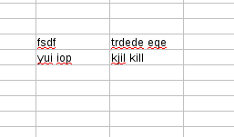
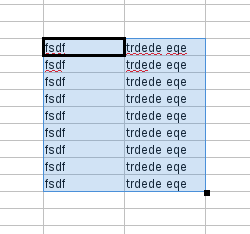
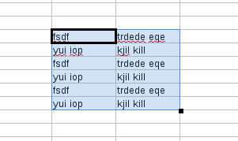

# Missing Red Squiggly underline bug

This post is about how the [red squiggly underline bug](https://bugs.documentfoundation.org/show_bug.cgi?id=84240) was resolved. 

If you do a string search for *“spelling”* in opengrok, you will come across the variable **bDoAutoSpell**. This boolean variable is a private memberof the class ScDocOptions. In order to access this variable, IsAutoSpell() can be used. To set this boolean variable, SetAutoSpell(bool bval) can be used.

Search for *“IsAutoSpell”*, and go to [this](http://opengrok.libreoffice.org/xref/core/sc/source/ui/app/scmod.cxx#1910) usage. 

Consider this line
```
bool bSpell = pViewSh->ContinueOnlineSpelling()(pViewSh is of type ScTabViewShell*)
```
Search for the usages of ContinueOnlineSpelling(). This function is a public member of class ScGridWindow. This function uses a variable mpSpellCheckCxt of type

`std::unique_ptr`

SpellCheckContext also contains the structure variable `CellPos maPos`, which can be used in the following manner.
```
maPos->mnCol

maPos->mnRow
```
to get the column and row coordinates for spellcheck. ScGridWindow has other functions such as ResetAutoSpell(), EnableAutoSpell(), SetAutoSpell(), HandleMouseButtonDown() etc.

SetAutoSpell() function:

`void ScGridWindow::SetAutoSpellData( SCCOL nPosX, SCROW nPosY, const std::vector * pRanges )`

this function takes as input nPosX and nPosY (which are of type SCCOL and SCROW respectively) to set the mis-spelling ranges as

`mpSpellCheckCxt->setMisspellRanges(nPosX, nPosY, pRanges);`

mpSpellCheckCxt can be used to access functions such as isMisSpelled(), getMisspellRanges, setMisspellRanges, reset() etc.

[http://opengrok.libreoffice.org/xref/core/sc/source/ui/view/spellcheckcontext.cxx](http://opengrok.libreoffice.org/xref/core/sc/source/ui/view/spellcheckcontext.cxx)

Using **gdb** it can be verified that MouseButtonUp() is called when the drag and copy is done in calc. Further, using the gdb it was found that the else part

`pViewData->GetDispatcher().Execute( FID_FILL_AUTO, SfxCallMode::SLOT| SfxCallMode::RECORD )`
was executed.
pRanges contains the mis-spelling ranges that needs the red squiggly line for a specified cell.MpSpellCheckCxt is of type
`std::unique_ptr`

SpellCheckContext is a structure that contains
```
typedef std::unordered_map<CellPos,
std::vector,CellPos::Hash>CellMapType;
CellMapType maMisSpellCells;
```
Each mis-spelled cell is a hash map into which the key is the cellposition(column, row) and value, a vector of MisspellRanges.

The basic idea is to simply copy the already computed mis-spelling ranges to the selected area, instead of again checking the spelling on the copied area (which is the same as the area for which spell checking has already been done). There are basically 4 kinds of drag and copy: 

* TOP_TO_BOTTOM

* BOTTOM_TO_TOP

* LEFT_TO_RIGHT

* RIGHT_TO_LEFT.

After ScCellShell Execute() is done, the code for handling the various kinds of drag and copy can be added. But, developer Eike Rathke commented that if the code is placed inside SCGridWindow, the case of ctrl-D copy wouldn’t be handled. Besides, this functionality is not intended to be placed inside a function such as MouseButtonUp(). So, instead this code can be placed in a file where FID_FILL_AUTO is executed.

It would be useful to write a wrapper function (like SetAutoSpellData()) called GetAutoSpellData() in ScGridWindow. This function will in turn call the function getMisspellingRanges()that will set the mis-spelling ranges given positions x and y.

If you search for FID_FILL_AUTO in opengrok you will come across [this](http://opengrok.libreoffice.org/xref/core/sc/source/ui/view/cellsh1.cxx#791)

and further down there’s a line `pTabViewShell->FillAuto( eDir, nStartCol, nStartRow, nEndCol, nEndRow, nCount )`

FillAuto() function is a member of ScViewFunc.FillSimple() is another member of ScViewFunc.

There are two types of copy methods, 

1. Selecting the source data and extending range and pressing ctrl-D. 

2. Selecting the source data and range extending by clicking the cross hair of the cell.

Following is the spreadsheet data before performing both type of copies.



*1.* FillSimple() copies only the first row of the entire block.



*2.* FillAuto() copies the entire block.



The code for performing the copy of the settings for the mis-spelling ranges can be placed in ScViewFunc. To see the code that was added go to
[https://gerrit.libreoffice.org/#/c/14872/](https://gerrit.libreoffice.org/#/c/14872/)
